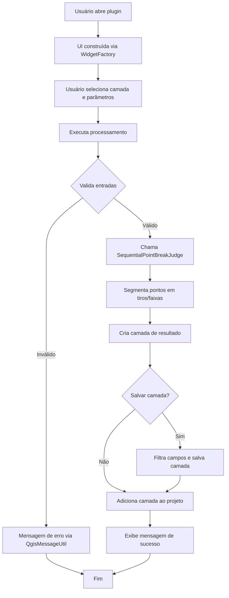

# DividePointsByStripsPlugin

## Diagrama de Fluxo

## Fluxo Resumido

1. Usuário abre o plugin pelo menu ou atalho.
2. Interface é construída dinamicamente via WidgetFactory.
3. Usuário seleciona camada de pontos, campos e parâmetros.
4. Ao executar:
   - Valida entradas obrigatórias.
   - Se inválido, exibe mensagem de erro.
   - Se válido, chama SequentialPointBreakJudge para segmentação.
   - Cria camada de resultado.
   - Se opção de salvar estiver marcada, filtra campos e salva camada.
   - Adiciona camada ao projeto.
   - Exibe mensagem de sucesso com resumo.

## Integrações
- UI: WidgetFactory
- Persistência: Preferences
- Processamento: SequentialPointBreakJudge
- Mensagens: QgisMessageUtil
- Manipulação de camadas: VectorLayerSource, ProjectUtils

---

> Documentação gerada automaticamente em 17/04/2026.
